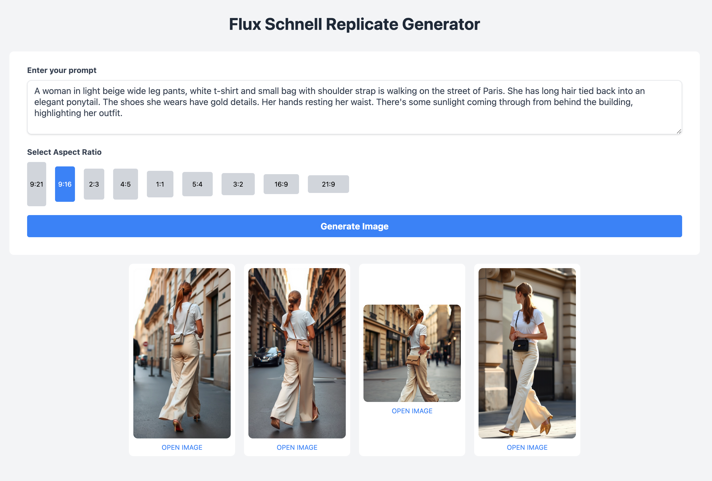

# Flux Schnell Replicate Generator
The **Flux Schnell Replicate Generator** is a small TS/BUN script that display a simple UI to leverage the [Replicate API](https://replicate.com/) to generate images using the "Flux [Schnell]" model.



## Requirements
- [Bun](https://bun.sh/) installed on your system.
- A valid Replicate API token.

## Setup
### 1. Clone the Repository
```bash
git clone https://github.com/xcrap/flux-schnell-replicate-generator.git
cd flux-schnell-replicate-generator
```
### 2. Rename the .env.example file to .env and add your Replicate API token:
```bash
REPLICATE_API_TOKEN=your_replicate_api_token_here
DEBUG=FALSE
PORT=3000
```

### 3. Install dependencies, build the CSS and run the development server:
Install dependencies using Bun,
```bash
bun install
bun run build
bun run dev
```

Access the application at http://localhost:3000. (Or whatever port you specified in the .env file)

### Possible TODO List
- Make a proper UI
- Add schema support to load additional image models
- Add a lightbox to the generated images
- Add a option to delete the generated or all generated images
- Add a option copy a generated images prompts to prompt input
- Cancel Job Training
